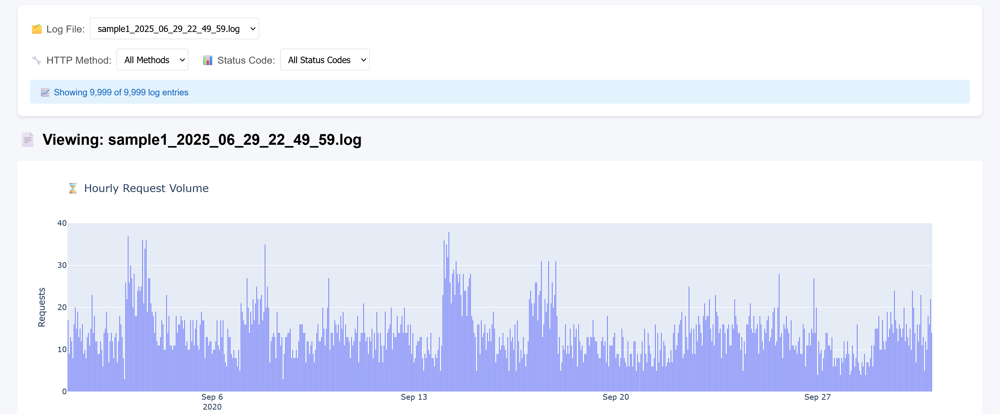
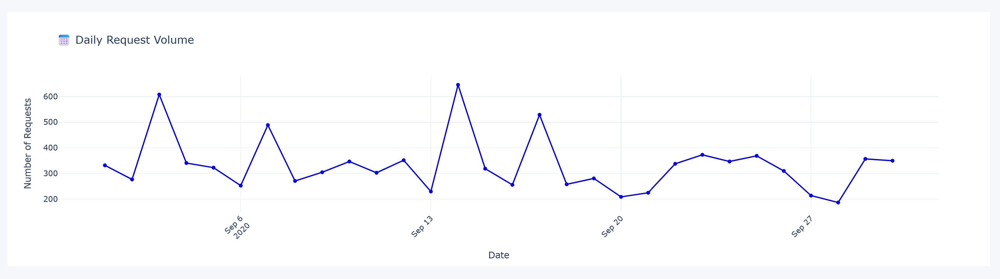

# smart-log-file-analyzer
Built a Python-based tool that analyzes massive server log files in Apache Combined Log Format to identify patterns, group data, extract actionable insights (e.g., most common IPs, popular endpoints, frequent status codes), and generate clean, human-readable reports in web or PDF format.

Log data format: 
```
<IP> - - [<DATE>] "<METHOD> <URL> HTTP/1.1" <STATUS> <SIZE> "<REFERRER>" "<USER AGENT>"
```

Example:
```
66.249.76.135 - - [01/Sep/2020:05:04:45 +0200] "GET /robots.txt HTTP/1.1" 200 646 "-" "Mozilla/5.0 (Macintosh; Intel Mac OS X 10_15_7) AppleWebKit/537.36 (KHTML, like Gecko) Chrome/91.0.4472.124 Safari/537.36"
```




Filtering By Status Code: 404


