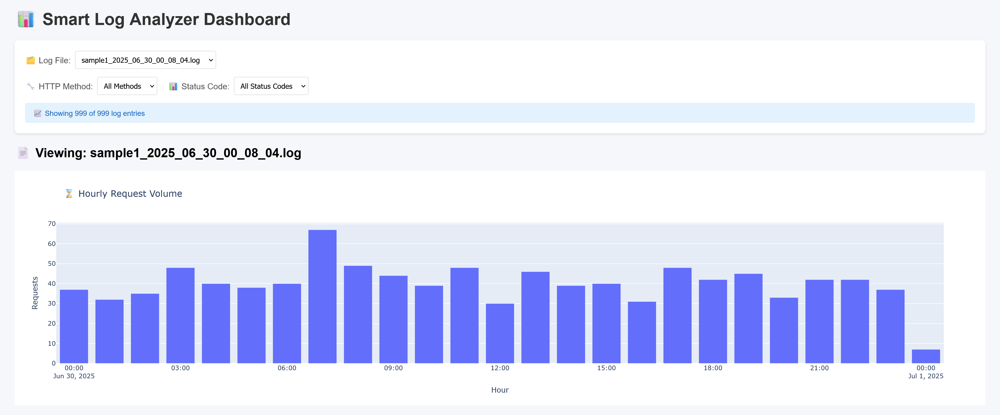
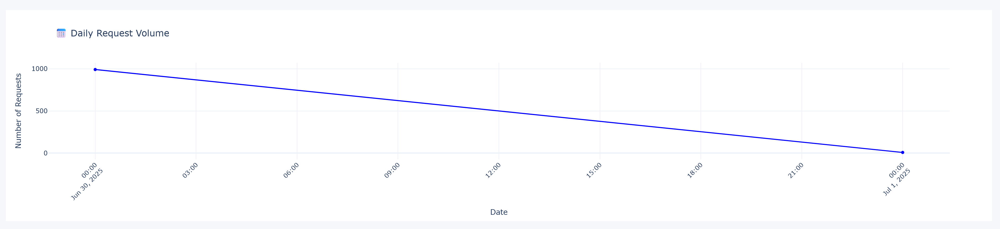
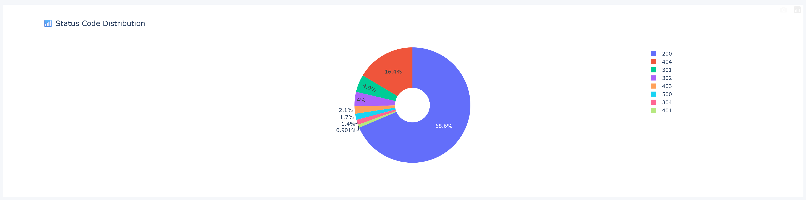
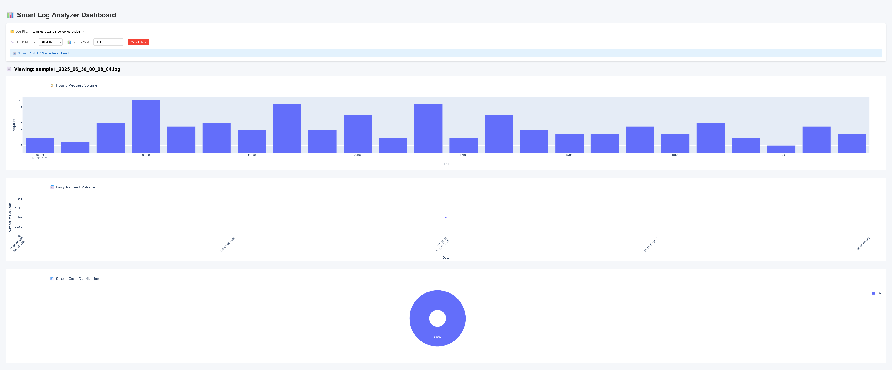
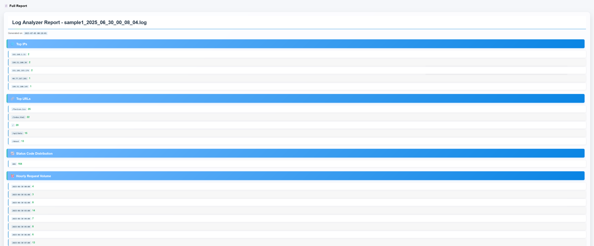

# smart-log-file-analyzer
Built a Python-based tool that analyzes massive server log files in Apache Combined Log Format to identify patterns, group data, extract actionable insights (e.g., most common IPs, popular endpoints, frequent status codes), and generate clean, human-readable reports in web or PDF format.

Log data format: 
```
<IP> - - [<DATE>] "<METHOD> <URL> HTTP/1.1" <STATUS> <SIZE> "<REFERRER>" "<USER AGENT>"
```

Example:
```
66.249.76.135 - - [01/Sep/2020:05:04:45 +0200] "GET /robots.txt HTTP/1.1" 200 646 "-" "Mozilla/5.0 (Macintosh; Intel Mac OS X 10_15_7) AppleWebKit/537.36 (KHTML, like Gecko) Chrome/91.0.4472.124 Safari/537.36"
```




Filtering By Status Code: 404

Most Frequent


- top_ips: Most frequent IP addresses accessing the server
- top_urls: Most requested endpoints or resources
- status_distribution: HTTP status code counts (200, 404, etc.)
- hour_counts: Number of requests per hour (traffic heatmap)
- day_counts: Number of requests per day (daily trend)
- user_agent_classes: Breakdown of user agent types (e.g., browser, bot, CLI)

---
### Usage
### CLI Mode

You will be prompted to enter the path to a .log file.
Or, specify the file directly:
```
python main.py logs/your_log_file.log
```

Web Dashboard
```
python main.py web
```

---

### 🔧 Testing with Sample Logs

To test the analyzer without using real server logs, you can generate synthetic log files in the correct Apache Combined Log Format.

Run the script in `sample_data/generate_sample_logs.py` to create a demo log file for analysis:

```bash
python sample_data/generate_sample_logs.py
